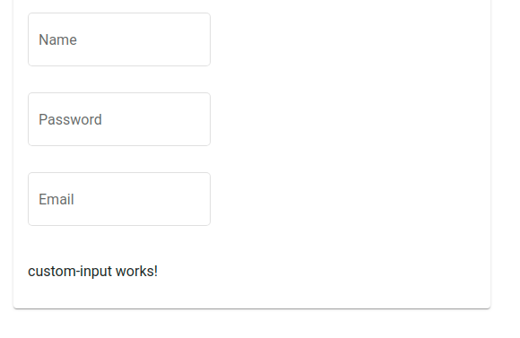

# Defining custom form inputs

With dynamic forms you can use your own components.
 Any angular component can be used with dynamic forms. 
 All you have to do is implement the `ConfigurableInput` interface.

`ng generate component custom-input`

Implement the ConfigurableInput interface in the component controller class.

```typescript
export class CustomInputComponent implements ConfigurableInput {
  
  formControl = new FormControl();  

  applyArguments(args: any): any {
    /* here you can use the args passed in the annotation 
        to configure your input. */
  }

  getFormControl(): any {
    return this.formControl;
  }
  
}
```

Use the `@CustomInput` annotation in your model to bind your component to a field.

```typescript
export class User {

  /* ... */

  @CustomInput(CustomInputComponent, {label: "Custom Input", args: {}})
  myCustomInput;

}
```

The `@CustomInput` decorator accepts an args object that will be sent as input to the `applyArguments` method to apply component specific settings.



